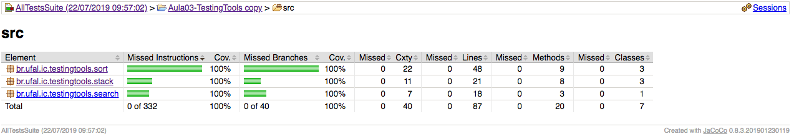
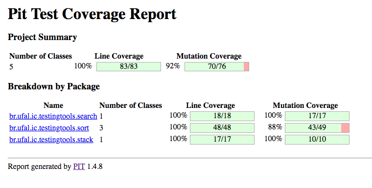

# Aula 03, 04 e 05

Cobertura de Código

Testes de Mutação

java -cp bin/:lib/* org.pitest.mutationtest.commandline.MutationCoverageReport --reportDir report/mutacao --targetClasses br.* --targetTests br.* --sourceDirs src/* --excludedClasses *Test*

URL: report/mutacao/201908051620